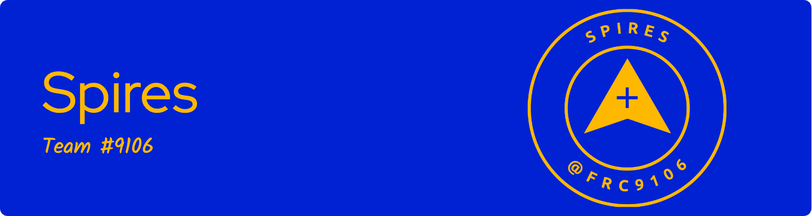

# spiresRobot2026

Main 2026 Robot Code for FRC Team 9106 - Spires



---

Thank you to our sponsors!

This repository started as a fork of [FRC#1736 RobotCasserole2026](https://github.com/RobotCasserole1736/RobotCasserole2026). 
Then PyKit logging from [FRC#1757 Westwood Robotics 2026-Rebuilt](https://github.com/1757WestwoodRobotics/2026-Rebuilt).
We think we might see if the software can be configured to use either Robot Casserole Swerve or Westwood Robotics Swerve

We are grateful to Teams #1736 and #1757 for the inspiration!


## Installation

TODO - clean this up to reflect a `uv` python development environment.

Before developing code on a new computer, perform the following:

1. [Download and install wpilib](https://github.com/wpilibsuite/allwpilib/releases)
2. [Download and install python](https://www.python.org/downloads/)
3. cd to this directory
3. run these commands:

```cmd
    python -m pip install --upgrade pip
    python -m venv .venv
```

`. .\.venv\bin\activate` or `.\.venv\Scripts\activate`

```cmd
    python -m pip install -r requirements_dev.txt
    robotpy sync
```

## Docs

- [High level code design patterns](.docs/designPatterns)
- [Commonly used modules in this repository](.docs/commonModules)
- [Most recent relationship diagram between classes](.docs/graph.md)
    - Keep this file up to date by periodically running `codeStructureReportGen/reportGen.py`


## The robot website

On a simulator
- http://localhost:5805/

On a RoboRIO
- http://10.91.6.2:5805/
- Be sure that you are connected to the RoboRIO's network via WiFi or Ethernet

## Interesting links

[RobotPy source code](https://github.com/robotpy/mostrobotpy)

[PyTest Docs](https://docs.pytest.org/en/7.4.x/)

[PyTest Examples](https://pytest.org/en/7.4.x/example/index.html)

## Deploying to the Robot

Use the `WPILib: Deploy Robot Code` task in VSCode's command palette.

OR

`robotpy deploy` will deploy all code to the robot. Be sure to be on the robot's network via WiFi or Ethernet.

### Deploy Notes

`robotpy deploy --skip-tests` to avoid requiring tests to pass before deployment can proceed. This is helpful for quick iterations, but don't make it a bad habit.

`.deploy_cfg` contains specific configuration about the deploy process.

Any folder or file prefixed with a `.` will be skipped in the deploy. This is good to avoid sending unnecessary files to the resource limited RoboRIO like documentation and images.

## Linting

"Linting" is the process of checking our code format and style to keep it looking nice and avoid unnecessary inconsistencies.

`pylint --rcfile=.pylintrc **\*.py`

`.pylintrc` contains configuration about what checks the linter runs, and what formatting it enforces


to lint a specific directory:

`pylint --rcfile=.pylintrc --source-roots=. utils\**\*.py`

to lint a specific file:

`pylint --rcfile=.pylintrc --source-roots=. drivetrain\poseEstimation\drivetrainPoseEstimator.py`

## Testing

Run the `WPILib: Test Robot Code` task in VSCode's command palette.

OR

`robotpy test`

OR to get details of what is happening during the tests:

`robotpy test -- --no-header -vvv -s`

OR to run a specific test file from the '.\tests' directory:

`robotpy test autoSequencer_test.py -- --no-header -vvv -s`

OR to run a specific test file and test case from the '.\tests' directory:

`robotpy test autoSequencer_test.py::test_parallel -- --no-header -vvv -s`

OR to skip a specific test:

`robotpy test -- -k 'not pyfrc_test.py'`

## Simulating

Run the `WPILib: Simulate Robot Code` task in VSCode's command palette.

OR

`robotpy sim`

## Dependency Management

`requirements_dev.txt` is used to list dependencies that we only need on our development computers, not on the RoboRIO.
Some tools like linting and formatting aren't mission-critical (or even used) at runtime, but still very helpful to
have.
`robotpy` is on this is on this list because it exists on the development computers, and by placing it on this list
it removes an installation step.

`robotpy` then uses `pyproject.toml` to the dependencies that are required to be installed on the RoboRIO for our code
to successfully run. For tests and simulations you will also need these dependencies on your development machine.
They are managed automatically via `robotpy sync`.

## To rebuild a '.venv' from scratch

`. .\.venv\bin\activate` or `.\.venv\Scripts\activate`

```cmd
python -m pip freeze > temp.txt
python -m pip uninstall -y -r temp.txt
python -m pip install -r .\requirements_dev.txt
robotpy sync
```

## Useful commands:

See network logs: `python -m netconsole roboRIO-9106-frc.local` or `python -m netconsole 10.91.6.2`

SSH into the robot: `ssh lvuser@roboRIO-9106-frc.local` or `ssh lvuser@10.91.6.2`

## Roborio 2.0 image install

Use balenaEtcher to install the roborio image

The 2023 roborio 2.0 image is here:

C:\Program Files (x86)\National Instruments\LabVIEW 2020\project\roboRIO Tool\FRC Images\SD Images

The 2024 roboio 2.0 image is here:

C:\Program Files (x86)\National Instruments\LabVIEW 2023\project\roboRIO Tool\FRC Images\SD Images

use roborio team number setter to set the team number


## useful commands:

```
powershell {$Env:LOG_PATH="C:\spires\spiresRobot2026\pyLogs\pykit_20260209_132514.wpilog" ; $Env:LOG_PATH; uv run -- robotpy sim }
```
