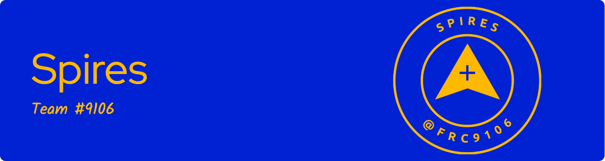

# spiresRobot2026

Main 2026 Robot Code for FRC Team 9106 - Spires



---

Thank you to our sponsors!

This repository started as a fork of [FRC#1736 RobotCasserole2026](https://github.com/RobotCasserole1736/RobotCasserole2026). 
Then PyKit logging from [FRC#1757 Westwood Robotics 2026-Rebuilt](https://github.com/1757WestwoodRobotics/2026-Rebuilt).
We think we might see if the software can be configured to use either Robot Casserole Swerve or Westwood Robotics Swerve

We are grateful to Teams #1736 and #1757 for the inspiration!


## Installation

TODO - clean this up to reflect a `uv` python development environment.

Before developing code on a new computer, perform the following:

1. [Download and install wpilib](https://github.com/wpilibsuite/allwpilib/releases)
2. [Download and install python 3.14](https://www.python.org/downloads/)

On Windows use the Python Installation Manager:
```
Welcome to the Python installation manager configuration helper.

********************************************************************************

Windows is not configured to allow paths longer than 260 characters.

Python and some other apps can exceed this limit, but it requires changing a
system-wide setting, which may need an administrator to approve, and will
require a reboot. Some packages may fail to install without long path support
enabled.
Update setting now? [y/N] y
The setting has been successfully updated, and will take effect after the next reboot.

********************************************************************************

The global shortcuts directory is not configured.

Configuring this enables commands like python3.14.exe to run from your
terminal, but is not needed for the python or py commands (for example, py
-V:3.14).

We can add the directory (C:\Users\mikestitt\AppData\Local\Python\bin) to PATH
now, but you will need to restart your terminal to use it. The entry will be
removed if you run py uninstall --purge, or else you can remove it manually when
uninstalling Python.
Add commands directory to your PATH now? [y/N] y
PATH has been updated, and will take effect after opening a new terminal.

********************************************************************************

You do not have the latest Python runtime.

Install the current latest version of CPython? If not, you can use 'py install
default' later to install.

Install CPython now? [Y/n] y
Python install manager was successfully updated to 26.0.

This update adds global shortcuts for installed scripts such as pip.exe.
Use py install --refresh to update all shortcuts.
This will be needed after installing new scripts, as it is not run automatically.

********************************************************************************
Installing Python 3.14.3.
Extracting: ...................................................................✅
To see all available commands, run 'py help'
********************************************************************************

********************************************************************************

Configuration checks completed.

To run these checks again, launch Python install manager from your Start menu,
or py install --configure from the terminal.

********************************************************************************

Usage:
    py <regular Python options>
                         Launch the default runtime with specified options. This
                         is the equivalent of the python command.
    py -V:<TAG>          Launch runtime identified by <TAG>, which should
                         include the company name if not PythonCore. Regular
                         Python options may follow this option.
    py -3<VERSION>       Equivalent to -V:PythonCore\3<VERSION>. The version
                         must begin with the digit 3, platform overrides are
                         permitted, and regular Python options may follow. py -3
                         is the equivalent of the python3 command.
    py exec <any of the above>
                         Equivalent to any of the above launch options, and the
                         requested runtime will be installed if needed.
    py help [<CMD>]      Show help for Python installation manager commands
    py install <TAG>     Download new Python runtimes, or pass --update to
                         update existing installs.
    py list [<FILTER>]   Show installed Python runtimes, optionally filtering by
                         <FILTER>.
    py uninstall <TAG>   Remove one or more runtimes from your machine. Pass
                         --purge to clean up all runtimes and cached files.

Find additional information at https://docs.python.org/dev/using/windows.

View online help? [y/N] N
```
3. [Download and install GitHub CLI](https://cli.github.com/)
4. https://git-scm.com/install/windows
5. https://cli.github.com/
6. uv: https://docs.astral.sh/uv/getting-started/installation/
3. cd to this directory
3. run these commands:

```
uv sync
uv run robotpy sync
uv run ruff check
uv run mypy .
uv run robotpy sim
uv run robotpy test
uv run robotpy deploy --skip-tests
```


## Docs

- [High level code design patterns](.docs/designPatterns)
- [Commonly used modules in this repository](.docs/commonModules)
- [Most recent relationship diagram between classes](.docs/graph.md)
    - Keep this file up to date by periodically running `codeStructureReportGen/reportGen.py`

  
## Interesting links

[RobotPy source code](https://github.com/robotpy/mostrobotpy)

[PyTest Docs](https://docs.pytest.org/en/7.4.x/)

[PyTest Examples](https://pytest.org/en/7.4.x/example/index.html)

## Deploying to the Robot


`uv run robotpy deploy` will deploy all code to the robot. Be sure to be on the robot's network via WiFi or Ethernet.

### Deploy Notes

`uv run robotpy deploy --skip-tests` to avoid requiring tests to pass before deployment can proceed. This is helpful for quick iterations, but don't make it a bad habit.

`.deploy_cfg` contains specific configuration about the deploy process.

Any folder or file prefixed with a `.` will be skipped in the deploy. This is good to avoid sending unnecessary files to the resource limited RoboRIO like documentation and images.

## Linting

"Linting" is the process of checking our code format and style to keep it looking nice and avoid unnecessary inconsistencies.

```
uv run ruff format --check
uv run ruff format
uv run mypy .
```


## Testing


`uv run robotpy test`

OR to get details of what is happening during the tests:

`uv run robotpy test -- --no-header -vvv -s`

OR to run a specific test file from the '.\tests' directory:

`uv run robotpy test autoSequencer_test.py -- --no-header -vvv -s`

OR to run a specific test file and test case from the '.\tests' directory:

`uv run robotpy test autoSequencer_test.py::test_parallel -- --no-header -vvv -s`

OR to skip a specific test:

`uv run robotpy test -- -k 'not pyfrc_test.py'`

## Simulating

`uv run robotpy sim`

## Dependency Management


## Useful commands:

See network logs: `uv run netconsole roboRIO-9106-frc.local` or `uv run netconsole 10.91.6.2`

SSH into the robot: `ssh lvuser@roboRIO-9106-frc.local` or `ssh lvuser@10.91.6.2`

## Roborio 2.0 image install

Use balenaEtcher to install the roborio image

The 2023 roborio 2.0 image is here:

C:\Program Files (x86)\National Instruments\LabVIEW 2020\project\roboRIO Tool\FRC Images\SD Images

The 2024 roboio 2.0 image is here:

C:\Program Files (x86)\National Instruments\LabVIEW 2023\project\roboRIO Tool\FRC Images\SD Images

use roborio team number setter to set the team number


## Notes

                "WIDTH": 24.5,
                "LENGTH": 22.5,

TOTAL_WIDTH = 28" = 0.711m
TOTAL_LENGTH = 26" = 0.660m

TOTAL_WIDTH_bumpers = 28"+2*4"= 36" = 0.9144m
TOTAL_LENGTH_bumpers = 26"+2*4"= 34" = 0.8636m

(4.0,4.3)
(2.3,5.9)

sim was: self.MAX_FWD_REV_SPEED_MPS=11.380736981619897
sim was: MAX_ROTATE_SPEED_RAD_PER_SEC=12.566370614359172

## useful commands:

```
powershell {$Env:LOG_PATH="C:\spires\spiresRobot2026\pyLogs\pykit_20260209_132514.wpilog" ; $Env:LOG_PATH; uv run -- robotpy sim }
```
